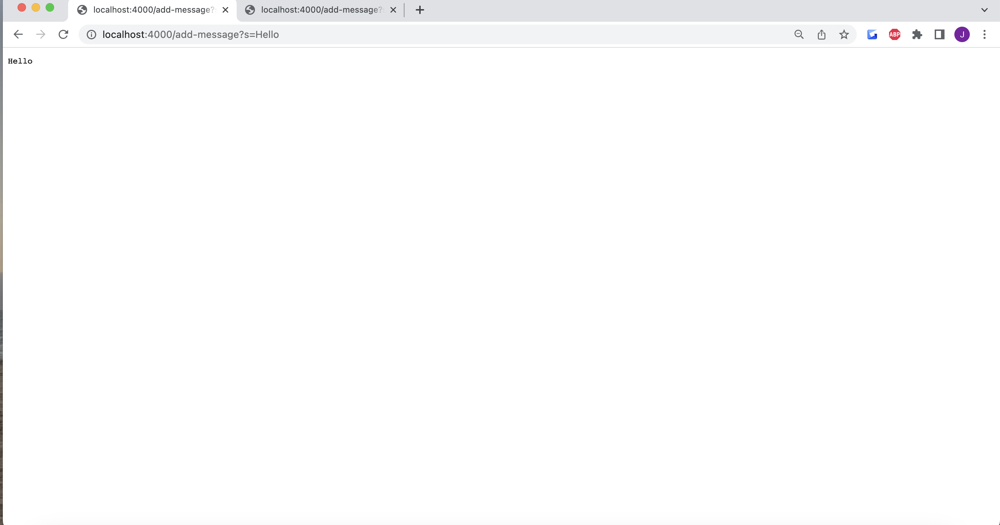
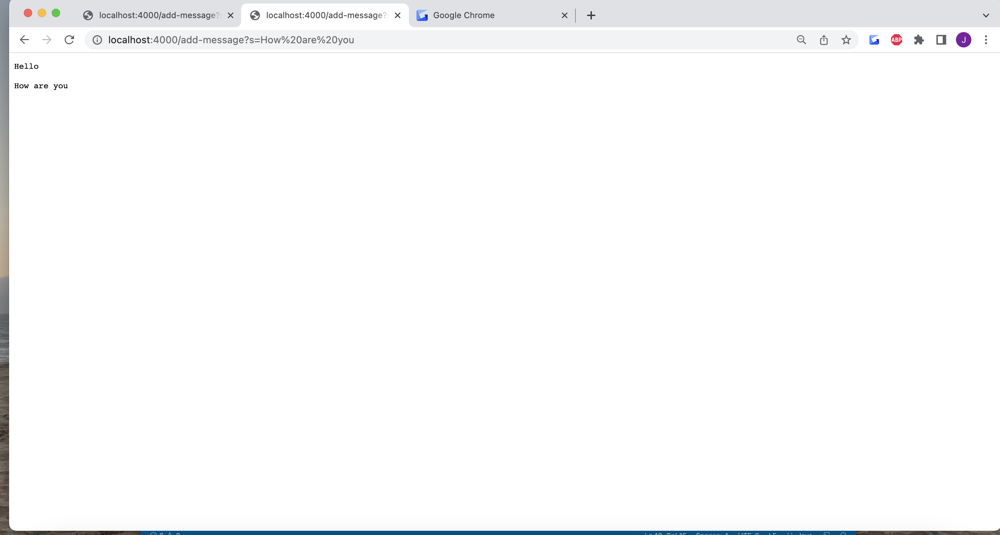

Lab Report 2
---

Part 1
---

```
import java.io.IOException;
import java.net.URI;

class Handler implements URLHandler {
    // The one bit of state on the server: a number that will be manipulated by
    // various requests.
    String string = "";

    public String handleRequest(URI url) {
        if (url.getPath().contains("/add-message")) {
            String[] parameters = url.getQuery().split("s=");
            
            if (string.equals("")) {
                string = parameters[1].concat("\n");
            } else {
                for (int i = 0; i < parameters.length; i++) {
                    string = string + parameters[i].concat("\n");     
                }
            } 
            return string;
        } 
        return "404 Not Found!";
    }
}

class StringServer {
    public static void main(String[] args) throws IOException {
        if(args.length == 0){
            System.out.println("Missing port number! Try any number between 1024 to 49151");
            return;
        }

        int port = Integer.parseInt(args[0]);

        Server.start(port, new Handler());
    }
}
```

For this first screenshot, the methods in my code that are called are getPath(), contains(), getQuery(), split(), equals(), and concat(). The respective relevant arguments to these  methods are /add-message?s=Hello for getPath, /add-message for contains, s=Hello for getQuery(), s= for split(), “” for equals(), and \n for concat(). The relevant fields that get changed from this specific request are “string.” Since the string is initially blank,  the string becomes “Hello” and becomes concat with \n. 


For this second screenshot, the methods in my code that are called are getPath(), contains(), getQuery(), split(), equals(), and concat(). The respective relevant arguments to these  methods are /add-message?s=Hello for getPath, /add-message for contains, s=Hello for getQuery(), s= for split(), “” for equals(), and \n for concat(). The relevant fields that get changed from this specific request are “string.” Right now, the string is “Hello\n” after the previous screenshot. After this screenshot, the string adds “How are you\n” making the string “Hello\nHow are you\n”.

Part 2
---
Failure inducing input Junit test

```
@Test
 public void testReversed2() {
   int[] input2 = { 3, 6, 9 };
   assertArrayEquals(new int[]{ 9, 6, 3 }, ArrayExamples.reversed(input2));
 }
```

Method

```
 static int[] reversed(int[] arr) {
   int[] newArray = new int[arr.length];
   for(int i = 0; i < arr.length; i += 1) {
     arr[i] = newArray[arr.length - i - 1];
   }
   return arr;
 }

```

Input that doesn't induce a failure
Junit

```
@Test
 public void testReversed() {
   int[] input1 = { };
   assertArrayEquals(new int[]{ }, ArrayExamples.reversed(input1));
 }
 ```
 
 Method
 
 ```
 static int[] reversed(int[] arr) {
   int[] newArray = new int[arr.length];
   for(int i = 0; i < arr.length; i += 1) {
     arr[i] = newArray[arr.length - i - 1];
   }
   return arr;
 }
```


