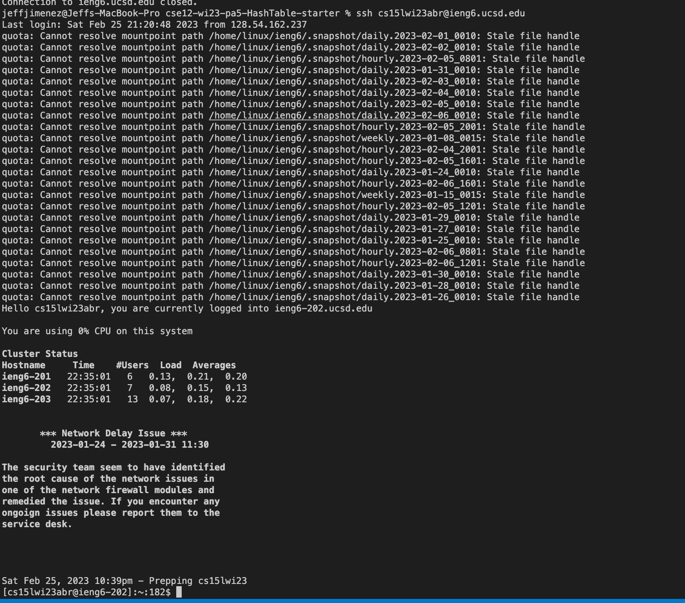

# Lab Report 4

Step 4: Log into ieng6
---

 * 
 * Keys pressed: `<command-tab>`, Triple Click, `<Ctrl-C>`, `<Ctrl-V>`, `<enter>`
 * Command-tab switches tab so I can see the window where I have the commands already written out so I can easily copy and paste it. Triple click the "ssh <email>" line so it is highlighted. Once highlighted, I ctrl-c to copy and then ctrl-v to paste it.
 * a
