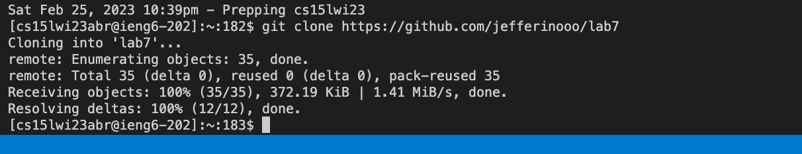
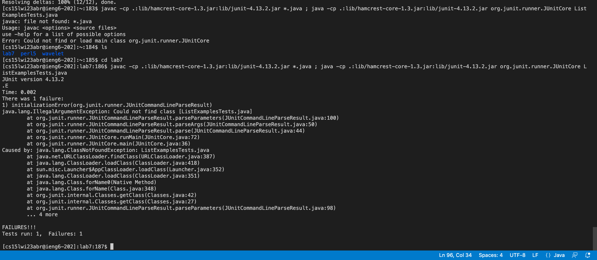
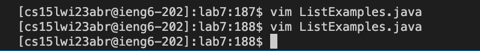
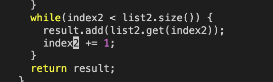

# Lab Report 4

Step 4: Log into ieng6
---

 * 
 * Keys pressed: `<command-tab>`, Triple Click, `<Ctrl-C>`, `<Ctrl-V>`, `<enter>`
 * Command-tab switches tab so I can see the window where I have the commands already written out so I can easily copy and paste it. Triple click the `"ssh <email>"` line so it is highlighted. Once highlighted, I ctrl-c to copy and then ctrl-v to paste it.
 
Step 5: Clone your fork of the repository from your github account
---

* 
* Keys pressed: `<command-tab>`, Triple Click, `<Ctrl-C>`, `<Ctrl-V>`, `<enter>`
 * Command-tab switches tab so I can see the window where I have the commands already written out so I can easily copy and paste it. Triple click the `"git clone <link>"` line so it is highlighted. Once highlighted, I ctrl-c to copy and then ctrl-v to paste it.

Step 6: Run the tests, demonstrating that they fail
---

* 
* Keys pressed: `<command-tab>`, `<Triple Click>`, `<Ctrl-C>`, `<Ctrl-V>`, `<enter>`, ls, `<enter>`, cd lab7, `<enter>`, `<command-tab>`, `<Triple Click>`, `<Ctrl-C>`, `<Ctrl-V>`, `<enter>`
* Command-tab switches tab so I can see the window where I have the commands already written out so I can easily copy and paste it. Triple click the `javac` line so it is highlighted. Once highlighted, I ctrl-c to copy and then ctrl-v to paste it. However, I did not cd into the directory so I check the folders I can cd into and then cd into lab7. Once I do that, I'm able to run the test.

Step 7: Edit the code file to fix the failing test
---

* 
* 
* Keys pressed: `<command-tab>`, `<Triple Click>`, `<Ctrl-C>`, `<Ctrl-V>`, `<enter>`, `<i>`, `<click>`, `<backspace>`, 2,  `<escape>`, `<:wq>`, `<enter>`, `<Ctrl-V>`, `<enter>`, `<:wq>`
*  Command-tab switches tab so I can see the window where I have the commands already written out so I can easily copy and paste it. Triple click the `vim ListExamples.java` line so it is highlighted. Once highlighted, I ctrl-c to copy and then ctrl-v to paste it. I click i so the vim editor knows I want to make an edit then I make the necessary edit, replacing index1 with index2. I then leave the vim editor but then I forget to take a screenshot so I go back in to take one.

Step 8: Run the tests, demonstrating that they now succeed
---
