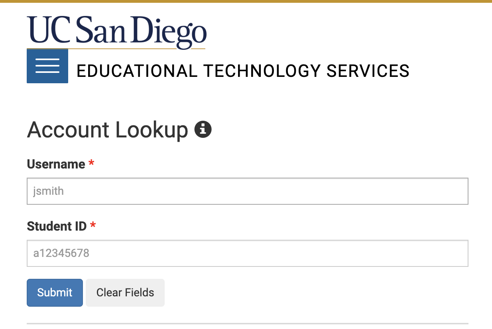
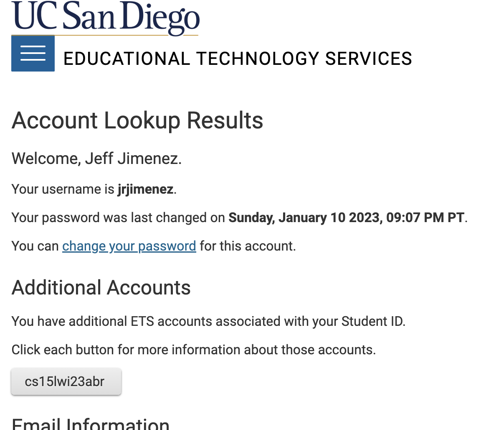

Tutorial
---

**How I Logged Into A Course-Specific Account On iEng6**

My tutorial will specifically be for students who are using a Mac device and will be catered to those who are using such devices.

1. Searching for Your Account
  * I went to https://sdacs.ucsd.edu/~icc/index.php and put in my username and student ID
  * 
  * I looked for the account that starts with "cs15lwi23" followed by various letters
  * 
  * I looked for the change password button and made a password that was at least 13 characters long then waited for the change to take effect
  * Now you should be aware of your course-specific account and password since you just reset it

2. Visual Studio Code
  * I went to https://code.visualstudio.com/, and downloaded Visual Studio Code (VSCode)
  * I opened VS Code and opened a Terminal by going to Terminal at the Top and clicking New Terminal
  * 

3. Remotely Connecting with VSCode
  * Since I am on a Mac, I did not have to download git or bash. Windows users will need to do so before following the same steps I am doing.
  * In the terminal, I typed in the following command (ignore the $, just type everything after and replace LETTERS corresponding with your respective account): $ cs15lwi23LETTERS@ieng6.ucsd.edu
  * Don't forget that after you type in your account to put @ieng6. then ucsd.edu, this was a mistake that I made when I was remotely connecting
  * After this, it will verify if you want to connect to the server. Put yes.
  * 
  * Then, it will ask for your password. If you try typing it, you won't see anything but the keys are being registered. It is hidden for privacy reasons.
  * Once you are logged in, it will show you a display and status.
  * 

4. Running Commands
  * Here, I tried various commands in the terminal
  * Here is a list of the various commands I tried
   1. cd ~
   2. cd
   3. ls -lat
   4. ls -a
  * 
  
